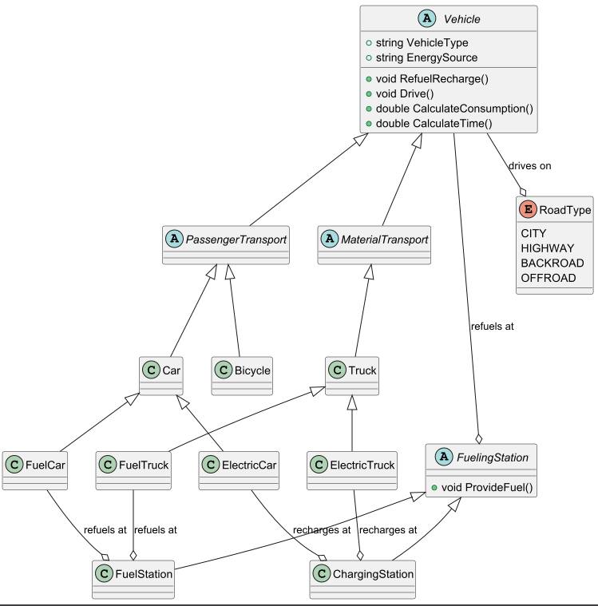
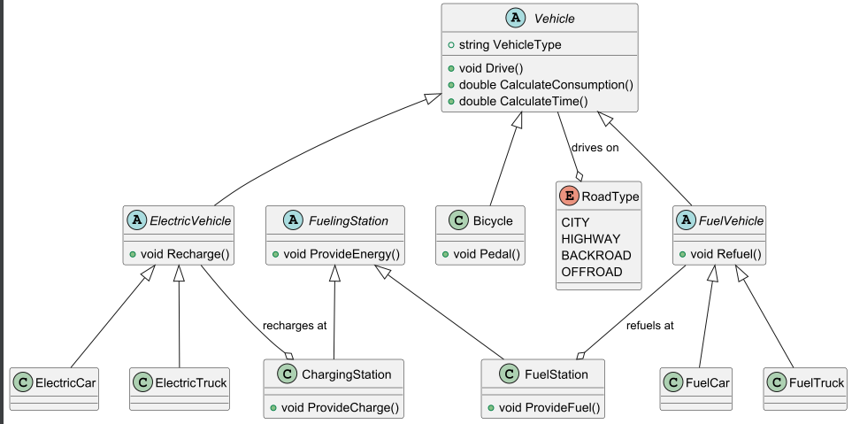
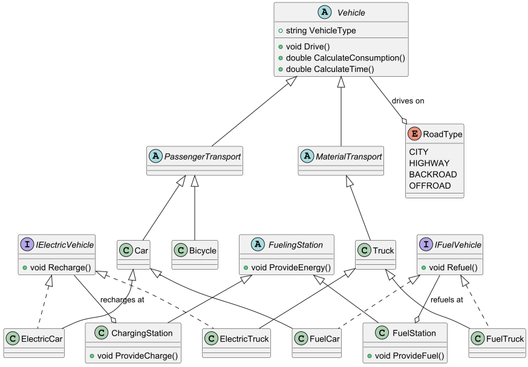

# Vehicles OOA

## Introduction
This document provides an object-oriented analysis (OOA) of the domain of vehicles, focusing on various types of vehicles, their energy sources, and driving conditions. The analysis identifies the key entities, their properties, and interactions within the domain.

## Overview
The domain consists of various types of vehicles designed for either passenger transport or material transport. These vehicles differ in their propulsion methods, fuel requirements, and capabilities. Additionally, a separate system handles refueling and recharging to ensure that each vehicle type receives the appropriate energy source.

## The Things

### Passenger Transport Vehicles
Vehicles primarily designed to transport people. Examples include:
- **Cars**
    - **Fuel Cars**: Personal and commercial passenger transport, typically powered by gasoline.
    - **Electric Cars**: Battery-powered passenger vehicles.
- **Bicycles**: Human-powered transport, which does not require external fuel.

### Material Transport Vehicles
Vehicles designed for moving goods and cargo. Examples include:
- **Trucks**
    - **Fuel Trucks**: Heavy-duty transport vehicles powered by gasoline.
    - **Electric Trucks**: Battery-powered trucks designed for cargo transport.

### Energy Sources
Vehicles require different sources of energy:
- **Fuel Station**: For gasoline and diesel vehicles.
- **Electric Charging Station**: For electric vehicles.

### Driving Conditions/Roads
Vehicles travel under different conditions that affect their performance:
- **City Roads**: Frequent stops, lower speeds, and higher energy consumption.
- **Highways**: Higher speeds with relatively lower energy consumption per kilometer.
- **Backroads**: Moderate speeds with some variations in energy usage.
- **Offroad**: Difficult terrain leading to higher energy consumption and reduced speed.

## Common Properties
- **Vehicle Type**: Defines whether the vehicle is for passenger or material transport.
- **Energy Source**: Specifies the type of fuel or energy the vehicle uses.
- **Driving Conditions**: The type of roads the vehicle travels on, affecting its performance.

## Actions and Resulting Changes
- **Refuel/Recharge**: Vehicles can refuel at fuel stations or recharge at electric charging stations.
- **Drive**: Vehicles can drive on different types of roads, affecting their speed and energy consumption.
- **Calculate Consumption**: Determine the energy consumption based on vehicle type and driving conditions.
- **Calculate Time**: Determine the travel time based on vehicle type and driving conditions.

## CRC Approach
- **Object**: Vehicle
    - **Responsibility**: Transport passengers or materials, consume energy, travel on roads.
    - **Collaboration**: Interacts with energy sources (fuel stations, charging stations) and driving conditions (roads).

- **Object**: Fuel Station
    - **Responsibility**: Provide fuel for gasoline and diesel vehicles.
    - **Collaboration**: Interacts with fuel-based vehicles.

- **Object**: Charging Station
    - **Responsibility**: Provide charging for electric vehicles.
    - **Collaboration**: Interacts with electric vehicles.

- **Object**: Road
    - **Responsibility**: Define driving conditions affecting vehicle performance.
    - **Collaboration**: Interacts with vehicles.

## Implementation Approaches

### Approach 1: Base Classes that Represent Transport Types
This Approach focuses on creating base classes for passenger and material transport vehicles, with subclasses for specific vehicle types (e.g., fuel cars, electric cars, fuel trucks, electric trucks).
The class diagram includes quite a lot of inheritance with a lot of common properties and methods in the base classes.

### Approach 2: Base Classes for Energy Sources
This Approach focuses on creating base classes for fuel and electric vehicles, with subclasses for specific vehicle types (e.g., fuel cars, electric cars, fuel trucks, electric trucks).
The class diagram includes less inheritance in total, but the base classes have more properties and methods.

### Approach 3: Combining the first two approaches with Interfaces
This Approach combines the previous two approaches by using interfaces to define common properties and methods for vehicle types and energy sources.
It uses a lot of interfaces to define the common properties and methods, and the classes implement these interfaces.
The class diagram is quite complex with a lot of abstraction and interfaces.
This is a way more flexible approach than the previous two but also more complex to implement.#

(This one is my personal favorite)

